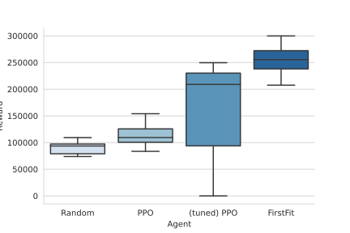
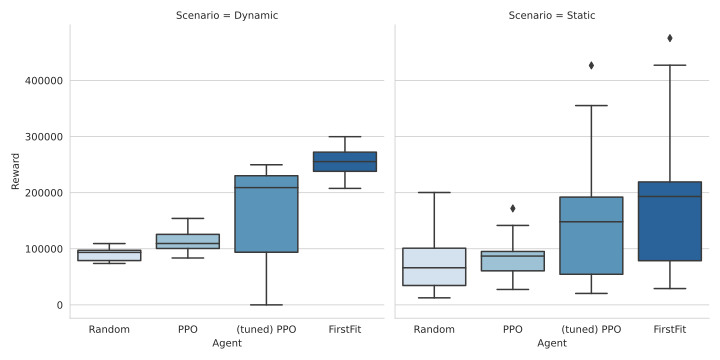
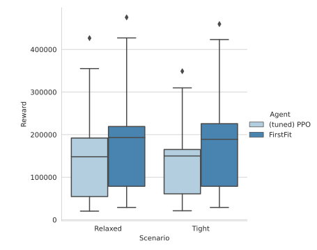

# NFVdeep
Deep Reinforcement Learning for Online Orchestration of Service Function Chains

*Disclaimer:* This is an unofficial implementation, trying to reproduce the deep reinforcement learning approach described in the [NFVdeep paper by  Xiao et al.](https://dl.acm.org/doi/abs/10.1145/3326285.3329056) as part of a graduate student project.
While the implemented agent did learn over time, we were not able to reproduce the same results stated in the paper.

**Advisor**: [Stefan Schneider](https://github.com/stefanbschneider)

**Developers**: [Nils Rudminat](https://github.com/NilsLuca), [Stefan Werner](https://github.com/stwerner97)

## Setup
Assuming an Anaconda (version 4.8.4) distribution has already been installed on an Ubuntu 18.04 machine, the environment can simply be cloned via `conda env create -f environment.yml`. Depending on your system's setup, the installation of additional packages for ``RayTune`` and the applied `Tensorflow` version might be necessary.  

## Experiments
The `script.py` file serves as an interface to running either baseline or DRL agents on the NFVdeep environment with their default parameterization, i.e. whithout employing hyperparamter optimization. Here, you can specify the overlay topology and the network's resources, as well as properties of the arrival process. For instance, we may train an stable-baseline's `PPO` DRL agent on the `abilene` network with incoming requests arising from a Poisson process by executing:
```console
python script.py
 --agent PPO 
 --overlay <data path>/abilene.gpickle 
 --requests <request path>/requests.json 
 --output <output path>
 --logs <log path>
```

## Hyperparameter Optimization
We employ distributed (single node) Bayesian Optimization with ``BoTorch`` and ``RayTune`` in order to faciliate scalable hyperparameter optimization for our Reinforcement Learning agent. Specifically, we first specify a parameter search space from whom agent configurations are first sampled and subsequently evaluated. Here, ``tune.py `` provides an interface to access our implementation's tuned DRL agents. Note, however, that absolute paths must be used, for instance by executing:
```console
python tune.py
 --agent PPO 
 --overlay <abs data path>/abilene.gpickle 
 --requests <abs request path>/requests.json 
 --output <abs output path>
 --logs <abs log path>
```

## Retrieving Placement Decisions
The placement decisions for VNFs of arriving service requests are automatically tabulated in the `placements.txt` file (shown below) under the `--output` path, whereas recorded monitoring metrics such as the obtained reward or acceptance rate are logged to `results.csv`. For each episode, trial and arriving service function request, we tabulate its arrival time, time-to-live, bandwidth demands, maximum end-to-end latency, requested VNFs (CPUs & memory) as well as a list of taken placement decisions (node indices). If the list of placements is empty, the request was not embedded to the substrate network and NFVdeep used its in-build backtracking mechanism to release bound resources.

````
 Episode    Trial    Arrival    TTL    Bandwidth    Max Latency    VNFs (CPUs & memory)     Placements
---------  -------  ---------  -----  -----------  -------------  -----------------------  ------------
        0        0       4495     73      71.2339          10000  [(7, 7.52), (10, 5.69)]  [0, 2]

````


# Experimental Study
Our evaluation is primarily based on generating arrival times with respect to a Poisson process (exponential arrival and service times) and is only loosely based on the evaluation proposed in the original NFVdeep paper. The load of individual SFCs and VNFs is uniformly sampled within their bounds specified in the respective `requests.json` files. All results simulate the SFC embedding problem on the real-world Abline network topology.

## Sampled Input Traffic
First, we train and evaluate under randomly sampled input traffic traces and compare among PPO also its tuned variant against two heuristic baselines, i.e. against the random placement policy and a greedy first fit ('FirstFit') heuristic. 
<p align="center">

</p>

Evidently, neither DRL agent matches the greedy baseline's performance in terms of the cumulated episode reward. However, both DRL agents improve upon random placement decisions and in few cases also accomplish competitive results. 

## Static Input Traffic 
The exogenous input process has a significant influence on an episode's trajectory independent from the respective agent's placement decisions. Therefore, training with episodes subject to randomly generated input traffic might cause high variance in the reward signal and ultimately prohibit effective policy improvement. Therefore, we replay input traffic in our experiments with 'static' input.
 <p align="center">

</p>

In comparison to the previous evaluation setup, the ``(tuned) PPO`` policy manages to close the reward gap to the ``FirstFit`` baseline significantly even though the greedy heuristic ultimately remains superior. 


## Latency Constraints
Lastly, we demonstrate that NFVdeep is not provided with effective means to learn concepts related to latency. Specifically, the agent is not provided with information that specifies its last placement decision and cannot determine an informed decision that minimizes latency. Hence, we compare the performance in two related scenarios where only the maximum latency constraints for SFCs vary.
 <p align="center">

</p> 
While the ``FirstFit`` baseline accomplishes similar performance in both scenarios (the imposed maximum latency does not pose significant constraints on the placements), we find that the DRL agent's performance deteriorates which is consistent with the prior hypothesis. 
